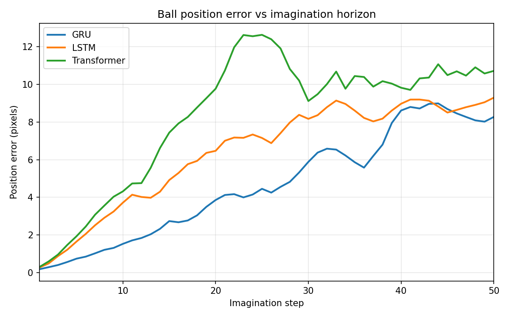
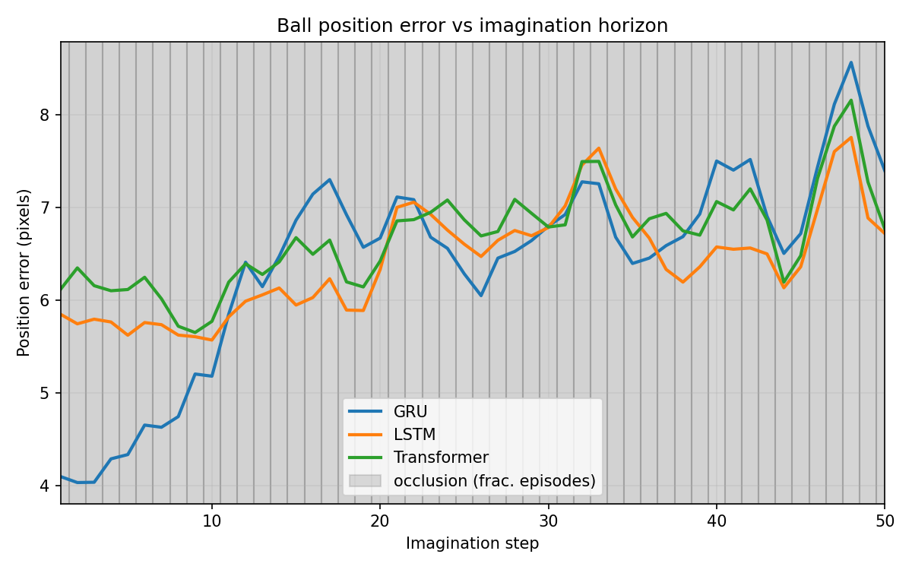
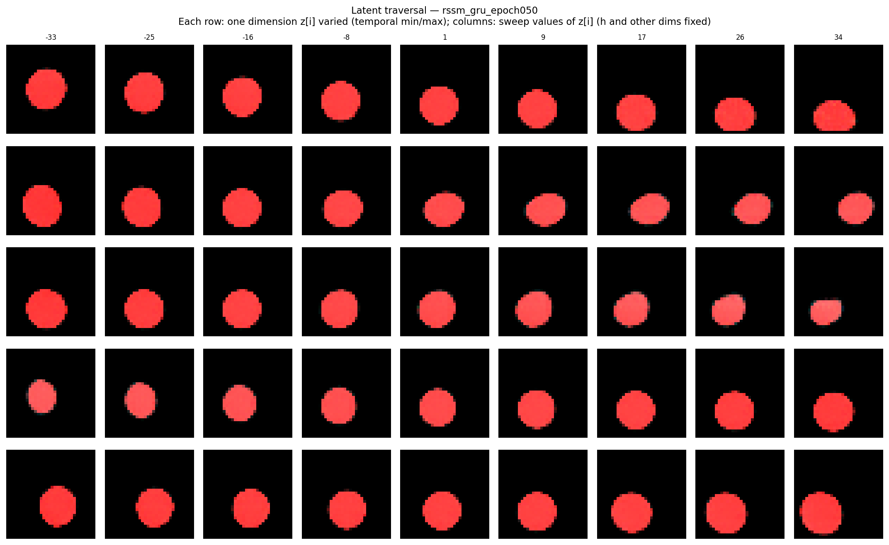
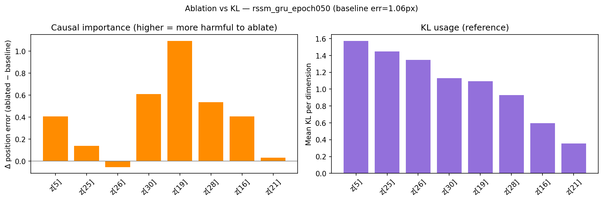

# RSSM World Model — Comparative Study of Temporal Backbones

A pixel-based **Recurrent State-Space Model (RSSM)** world model and a controlled study of three temporal backbones (GRU, LSTM, Transformer) on the same architecture, loss, and latent dimensions.

## Motivation

World models learn **dynamics** — how the world evolves — rather than static correlations. Unlike LLMs trained on text redundancy, a visual world model must track a moving object over time and roll out futures in imagination. This repo asks: **on controlled pixel dynamics, and at a modest data/compute budget, does architectural complexity help?**

> **Research question:** Which temporal backbone learns the best world model — and when (if ever) does a Transformer's long-range memory pay off over a simple GRU?

## Key results

### Part 1 — Simple bouncing ball (Markovian, no occlusion)

<p align="center">
  
</p>

Side-by-side real context vs. imagined rollout (GRU, no occlusion).

Ball-position error vs. imagination horizon. Lower is better.

<p align="center">
  
</p>

**GRU < LSTM < Transformer** — the GRU wins *at this data/compute budget*. The task is Markovian (current position and velocity suffice); no long-range memory is needed. The GRU's recurrent inductive bias is immediately useful, while the Transformer must learn temporal ordering and positional structure from scratch — a disadvantage when data is limited (see Limitations). All three backbones learn a well-populated latent `z` (no collapse) — the gap is predictive accuracy, not representation failure.

### Part 2 — Occlusion (short-term memory test)

A vertical opaque band hides the ball for ~2–4 frames; predicting reappearance requires remembering its trajectory.

<p align="center">
  
</p>

**All three backbones perform similarly during occlusion.** This is an honest result, not a failure — and it is *expected*: a 2–4 frame gap sits comfortably within the short memory of any RNN, so it does not exercise the long-range capability a Transformer would excel at. Distinguishing the architectures would require dependencies tens to hundreds of steps long (see Limitations). **On the difficulty scale tested here, architectural complexity does not help.**

<p align="center">
  
</p>

### Part 3 — Latent interpretability (without-occlusion models)

Read-only analysis of the stochastic latent `z` on models that reconstruct well. Three axes: latent traversal, causal ablation, latent structure.

<p align="center">
  
</p>

The latent **encodes dynamics**: active dimensions track the ball over time. **Partial, distributed disentanglement** emerges — horizontal-dominant groups (`z[25]`, `z[19]`) and vertical-dominant groups (`z[5]`, `z[30]`), but spread across correlated dimensions, not clean single "x" or "y" axes.

<p align="center">
  
</p>

**KL and causal importance measure different things.** KL per dimension reflects how hard the *prior* finds that variable to predict; causal importance (via ablation) reflects how much the *output* degrades when the dimension is removed. They do not coincide: `z[19]` has moderate KL but is the most critical under ablation, while `z[26]` has high KL yet is largely redundant (ablating it barely hurts). A dimension can carry information the prior struggles to anticipate without being causally necessary for reconstruction.

Detailed analysis and reproduction: **[interpretability/README.md](interpretability/README.md)**

### Overall conclusion

Within the tested regime — a simple, deterministic environment at a modest data/compute budget — **architectural complexity (LSTM, Transformer) does not help and can hurt**; the GRU is well matched to the task. Transformer advantages would likely require **much longer** temporal dependencies and **more data** than used here. The learned latent is **partially interpretable** (emergent x/y structure, distributed across dimensions), and **causal importance is not reducible to how much information a dimension encodes**. These are scoped empirical findings on a controlled benchmark, not universal architectural claims (see Limitations).

---

## Architecture

The RSSM maintains two latent states at each time step:

| Symbol | Role | Dim (default) |
|--------|------|---------------|
| `h_t` | Deterministic memory (backbone hidden state) | 200 |
| `z_t` | Stochastic latent (diagonal Gaussian) | 32 |

Components:

- **CNN Encoder** — `(3, 32, 32) → embed_dim`
- **Posterior** `q(z_t | h_t, e_t)` — refines belief with the observation
- **Prior** `p(z_t | h_t)` — predicts the next latent without seeing the image
- **Temporal Backbone** — `h_t = f(h_{t-1}, z_{t-1}, a_{t-1})`, swappable via `SequenceBackbone` (GRU / LSTM / Transformer)
- **CNN Decoder** — `concat(h_t, z_t) → (3, 32, 32)`

### Critical temporal ordering (at each step `t`)

```
1. state_t = backbone.step(state_{t-1}, z_{t-1}, a_{t-1})   # memory BEFORE observation
2. h_t = backbone.hidden(state_t)
3. mu_p, sigma_p = prior(h_t)
4. e_t = encoder(o_t)
5. mu_q, sigma_q = posterior(h_t, e_t)
6. z_t = mu_q + sigma_q * eps                              # sampled from posterior (training)
7. o_hat_t = decoder(h_t, z_t)
```

The backbone state is **opaque** (GRU: `h`; LSTM: `(h, c)`; Transformer: token sequence). The RSSM only uses `init_state` / `step` / `hidden`, which keeps backbones interchangeable.

### Loss

```
L = recon_loss + β · kl_loss
```

- **recon_loss** — squared error, **summed over pixels**, motion-weighted (moving pixels up-weighted via `lambda_motion`).
- **kl_loss** — `KL(q || p)` with **KL balancing** (DreamerV2, `α = 0.8`) to prevent posterior collapse.
- **β-annealing** — linear ramp over early training.

### Imagination (open loop)

After a short real **context** (posterior), roll out `H` steps with **prior only**:

```
state_t = backbone.step(state_{t-1}, z_{t-1}, a_{t-1})
z_t ~ p(z_t | h_t)
o_hat_t = decoder(h_t, z_t)
```

## Environment: bouncing ball

Synthetic NumPy environment: a filled disk (`radius ≈ 7`, ~15–20% of a 32×32 frame) bouncing elastically off walls. Large, high-contrast object — reconstructible by the CNN decoder (unlike a thin pendulum arm).

Frames stored as `uint8`, normalized to `[0,1]` on load. Observations: `(N, T, 3, 32, 32)` · actions: `(N, T, action_dim)` · lengths: `(N,)`.

Part 2 adds a vertical occlusion band (width configurable, e.g. w=17) and stores ground-truth `positions` for evaluation.

## Limitations & scope

These results are **scoped empirical findings on a controlled benchmark**, not universal architectural claims. Known limitations, and how they bound the conclusions:

- **Modest data/compute budget.** Training uses ~500 episodes × 200 steps (~100k frames) for 50 epochs. A GRU's recurrent inductive bias converges fast in this regime, whereas a Transformer — which must learn temporal relations and positional structure from scratch — is data-hungrier and may be **under-trained** here. The Part 1 ranking should therefore be read as *"at this budget"*, not as an intrinsic architectural verdict. A fairer Transformer comparison would scale data and training substantially.
- **Occlusion is short.** The ~2–4 frame gap tests short-term memory, which any RNN handles well. It does **not** probe the long-range regime where Transformers are expected to win. A genuine long-memory test would need occlusions of tens of frames, or a non-Markovian task (e.g. a key seen early that matters much later).
- **Continuous Gaussian latent.** This follows PlaNet/DreamerV1. DreamerV2/V3 moved to **discrete (categorical) latents** to model multimodal futures. The continuous latent works here because the ball dynamics are smooth, deterministic, and unimodal; on stochastic or multimodal environments it would be a limiting choice.
- **Transformer cost under the step-interface.** The unified `SequenceBackbone.step` recomputes attention over the accumulated context each step (O(T²), no KV cache), and the effective window is the training sequence length (25). This is fine for short sequences but is not an efficient long-context Transformer.

Treating these as open limitations (rather than hiding them) is deliberate: the value of the study is the controlled methodology and the interpretability analysis, within a clearly stated scope.

## Project structure

```
rssm_world_model/
├── README.md
├── assets/                 # figures for this README
├── requirements.txt
├── config.py
├── bouncing_ball.py
├── models/                 # encoder, decoder, backbone, rssm
├── data.py
├── train.py
├── imagine.py
├── evaluation.py           # position-error curves, multi-backbone comparison
├── interpretability/       # Part 3 — read-only latent analysis
└── utils.py
```

## Installation & usage

```bash
python -m venv .venv && source .venv/bin/activate
pip install -r requirements.txt
```

Requires **Python 3.10+** and **PyTorch 2.x** (CUDA → MPS → CPU auto-detected).

**Generate dataset:**

```bash
python train.py --env-name bouncing_ball --data-path data/bouncing_ball.npz \
  --force-collect --ball-radius 7 --num-episodes 500 --max-steps 200 --epochs 0 --no-wandb
```

**Train one backbone** (only `--backbone` changes between runs):

```bash
python train.py --env-name bouncing_ball --data-path data/bouncing_ball.npz \
  --checkpoint-dir checkpoints/without_occult --backbone gru \
  --epochs 50 --seq-len 25 --chunk-stride 10 --batch-size 128 \
  --lambda-motion 5 --kl-balance 0.8 --no-wandb
```

Repeat with `--backbone lstm` and `--backbone transformer`. For occlusion: `--occlusion-width 17` and matching data path.

**Comparative evaluation:**

```bash
python evaluation.py \
  --checkpoints checkpoints/without_occult/rssm_gru_epoch050.pt \
                checkpoints/without_occult/rssm_lstm_epoch050.pt \
                checkpoints/without_occult/rssm_transformers_epoch050.pt \
  --labels GRU LSTM Transformer \
  --context-len 10 --horizon 50 --n-episodes 30 \
  --output-dir outputs/without_occult
```

**Imagination GIF + KL diagnostic:**

```bash
python imagine.py --checkpoint checkpoints/without_occult/rssm_gru_epoch050.pt \
  --output-dir outputs/without_occult --context-len 10 --horizon 50
```

## Extending the backbone

```python
class SequenceBackbone(ABC, nn.Module):
    def init_state(self, batch_size, device): ...
    def step(self, state, z_prev, a_prev): ...
    def hidden(self, state): ...                     # (B, hidden_dim)
```

GRU, LSTM, and Transformer implement this interface. Adding a new backbone requires no changes to `train.py`, `imagine.py`, or `rssm.py`.

## Debugging notes

Real failure modes this project hit:

- **Posterior collapse** — empty `z`. Diagnose with KL-per-dimension bars; fix with KL balancing (free bits alone was insufficient).
- **Background domination** — plain averaged MSE ignored the moving ball (~1% of pixels). Fixed by summing over pixels + motion weighting.
- **Object too small** — a 1-pixel pendulum arm is unreconstructible; motivated the controllable ball radius on 32×32.
- **Validate visually** — inspect reconstructions and KL bars before long runs; low MSE can hide an empty latent.

## References

- Hafner et al., *Learning Latent Dynamics for Planning from Pixels* (PlaNet, 2019)
- Hafner et al., *Dream to Control: Learning Behaviors by Latent Imagination* (DreamerV1, 2020)
- Hafner et al., *Mastering Atari with Discrete World Models* (DreamerV2, 2021)
